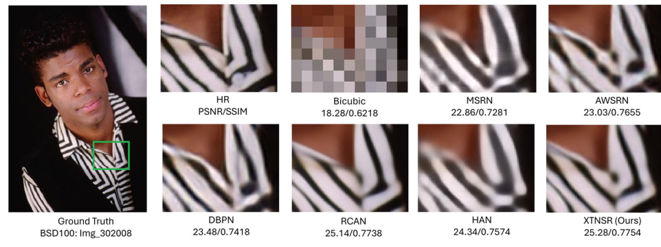
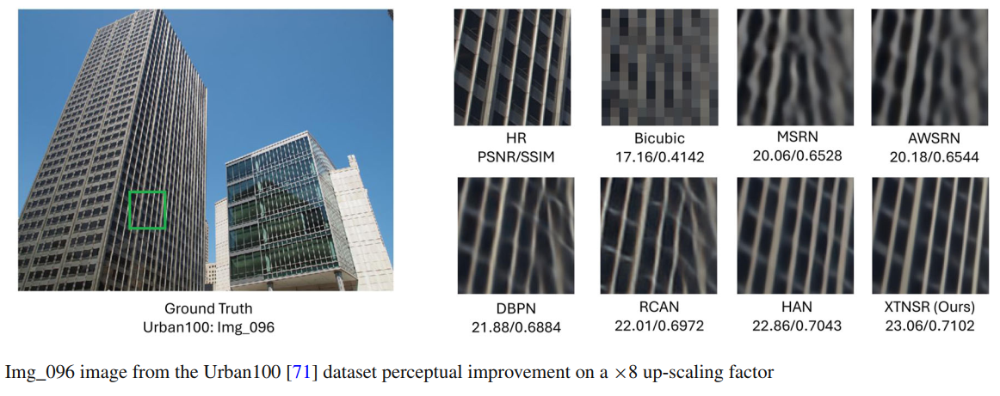
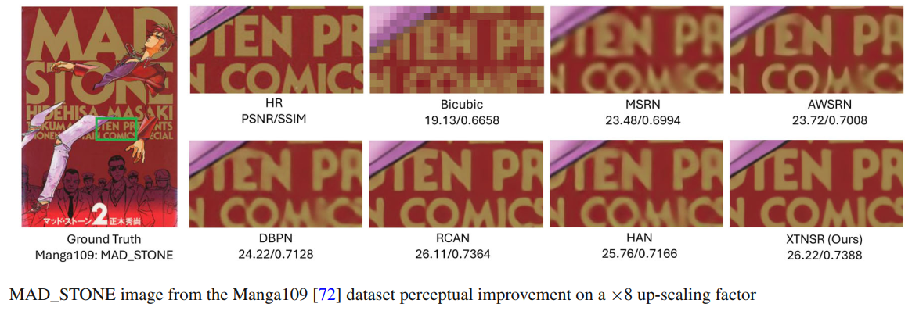
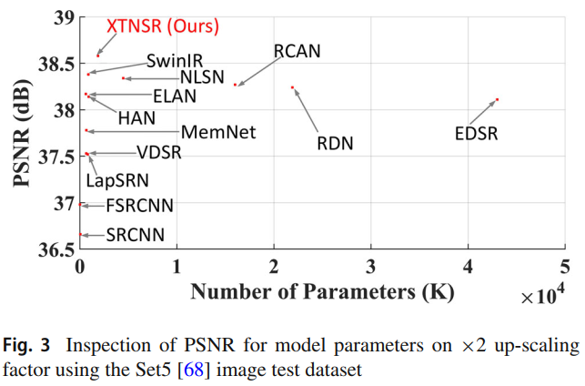
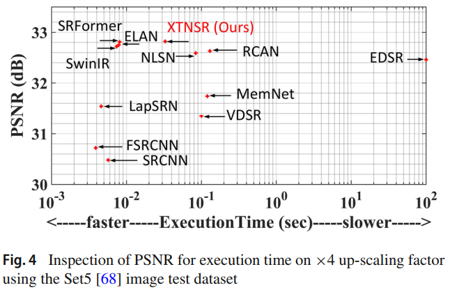

# DHTCUN
# Deep Hybrid Transformer CNN U Network for Single Image Super Resolution
This repository is for DHTCUN introduced in the following paper "Deep Hybrid Transformer CNN U Network for Single Image Super Resolution", IEEE Access, [[Link]](https://ieeexplore.ieee.org/stamp/stamp.jsp?arnumber=10648606&tag=1) 


The code is built on [HNCT (PyTorch)](https://github.com/lhjthp/HNCT) and tested on Ubuntu 18.04 environment (Python3.6, PyTorch >= 1.1.0) with NVIDIA GeForce GTX 2080ti GPU. 
## Contents
1. [Introduction](#introduction)
2. [Dependencies](#dependencies)
3. [Train](#train)
4. [Test](#test)
5. [Results](#results)
6. [Citation](#citation)
7. [Acknowledgements](#acknowledgements)

## Introduction

This repository contains the implementation of DHTCUN, a cutting-edge hybrid model combining Convolutional Neural Networks (CNNs) and Transformers for Single-Image Super-Resolution (SISR). The architecture features a U-shaped design with Parallel Hybrid Transformer CNN Blocks (PHTCB) and Triple Enhanced Spatial Attention (TESA) mechanisms to achieve superior high-resolution image reconstruction.


Key Highlights:

Parallel Hybrid Design: Combines CNNs and Transformers for long-range dependencies and noise reduction.

Triple Enhanced Spatial Attention: Focuses on critical image features while suppressing noise.

Computational Efficiency: Optimized with skip connections and pixel shuffle for reduced complexity.

DHTCUN significantly improves PSNR and SSIM scores across benchmark datasets while maintaining computational efficiency, making it ideal for applications like medical imaging, satellite imagery, and surveillance.

Deep Hybrid Transformer CNN U Network for Single Image Super Resolution.

## Dependencies
* Python 3.6
* PyTorch >= 1.0.0
* numpy
* skimage
* **imageio**
* matplotlib
* tqdm
* cv2 >= 3.xx (Only if you want to use video input/output)

## Train
### Prepare training data 

1. Download DIV2K training data (800 training + 100 validtion images) from [DIV2K dataset](https://data.vision.ee.ethz.ch/cvl/DIV2K/) or [SNU_CVLab](https://cv.snu.ac.kr/research/EDSR/DIV2K.tar).

2. Specify '--dir_data' based on the HR and LR images path. 

For more information, please refer to [HNCT(PyTorch)](https://github.com/lhjthp/HNCT).

### Begin to train

Cd to 'src', run the following script to train models.

 **Example command is in the file 'demo.sh'.**

    ```bash
    # Example X2 SR
    python main.py --dir_data ../../Dataset/ --n_GPUs 1 --rgb_range 1 --chunk_size 144 --n_hashes 4 --save_models --lr 1e-4 --decay 200-400-600-800 --epochs 300 --chop --save_results --n_resblocks 32 --n_feats 256 --res_scale 0.1 --batch_size 16 --model dhtcun --scale 2 --patch_size 96 --save DHTCUN_x2 --data_train DIV2K
    ```
## Test
### Quick start
1. Download benchmark datasets from [SNU_CVLab](https://cv.snu.ac.kr/research/EDSR/benchmark.tar)


Cd to 'src', run the following scripts.

 **Example command is in the file 'demo.sh'.**

    ```bash
    
    # Example X2 SR
    python main.py --dir_data ../../ --model dhtcun  --chunk_size 144 --data_test Set5+Set14+B100+Urban100+Manga109 --n_hashes 4 --chop --save_results --rgb_range 1 --data_range 801-900 --scale 2 --n_feats 256 --n_resblocks 32 --res_scale 0.1  --pre_train model_x2.pt --test_only 
    ```

## Results
### Visual Patches








### Quantitative Results






For more Quantitative Results please read the paper [[Link]](https://ieeexplore.ieee.org/stamp/stamp.jsp?arnumber=10648606&tag=1)

## Citation
If you find the code helpful in your research or work, please cite the following papers.
```
@ARTICLE{10648606,
  author={Talreja, Jagrati and Aramvith, Supavadee and Onoye, Takao},
  journal={IEEE Access}, 
  title={DHTCUN: Deep Hybrid Transformer CNN U Network for Single-Image Super-Resolution}, 
  year={2024},
  volume={12},
  number={},
  pages={122624-122641},
  keywords={Transformers;Superresolution;Convolutional neural networks;Noise measurement;Computational modeling;Noise measurement;Image reconstruction;CNN;enhanced spatial attention;single-image super-resolution;Transformer},
  doi={10.1109/ACCESS.2024.3450300}}

```

## Acknowledgements
This code is built on [HNCT (PyTorch)](https://github.com/lhjthp/HNCT/tree/main) and [EDSR-PyTorch](https://github.com/thstkdgus35/EDSR-PyTorch). We thank the authors for sharing their codes.


